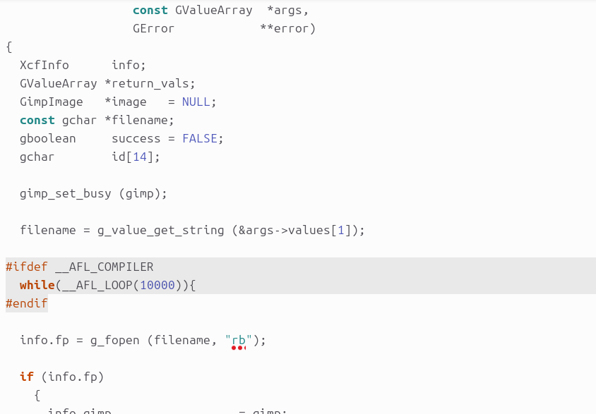
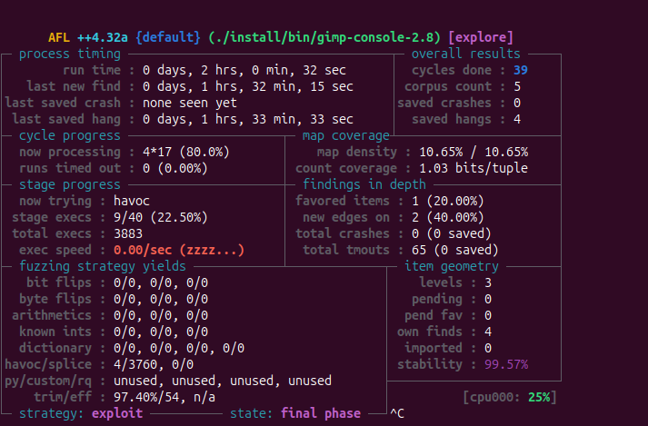
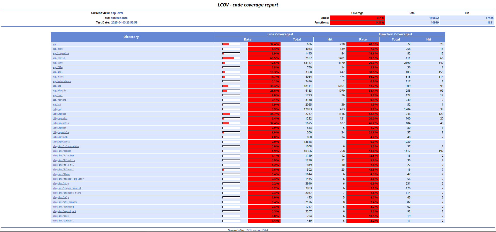

# mipt-fuzzing
Fuzzing project for MIPT-Sbertech course

## Пофайловое контрольное суммирование файлов исходного кода

Воспользуемся командой 
```bash
find . -type f -name "*.[ch]" -exec sha256sum {} + > checksums.sha256
```
Результат контрольного суммирования лежит в файле checksums.sha256
## Фаззинг-тестирование
Для начала установим и соберем GIMP

```bash
CC=afl-clang-lto CXX=afl-clang-lto++ PKG_CONFIG_PATH=$PKG_CONFIG_PATH:$HOME/Fuzzing_gimp/gegl-0.2.0/ CFLAGS="-fsanitize=address" CXXFLAGS="-fsanitize=address" LDFLAGS="-fsanitize=address" ./configure --disable-gtktest --disable-glibtest --disable-alsatest --disable-nls --without-libtiff --without-libjpeg --without-bzip2 --without-gs --without-libpng --without-libmng --without-libexif --without-aa --without-libxpm --without-webkit --without-librsvg --without-print --without-poppler --without-cairo-pdf --without-gvfs --without-libcurl --without-wmf --without-libjasper --without-alsa --without-gudev --disable-python --enable-gimp-console --without-mac-twain --without-script-fu --without-gudev --without-dbus --disable-mp --without-linux-input --without-xvfb-run --with-gif-compression=none --without-xmc --with-shm=none --enable-debug  --prefix="$HOME/Fuzzing_gimp/gimp-2.8.16/install"
```
```bash
make -j$(nproc)
```
```bash
make install
```
Отключили различные зависимости, которые не влияют на фаззинг. Собрали консольную версию проекта для удобства

Перед сборкой приложения внес изменения в файл для загрузки xcf файлов, чтобы включить персистентный режим. Каждый раз запускать приложение дорого 


Для запуска фаззинга прописываем следующий скрипт
```bash
ASAN_OPTIONS=detect_leaks=0,abort_on_error=1,symbolize=0 afl-fuzz -i './afl_in' -o './afl_out' -t 2000 -- ./install/bin/gimp-console-2.8 --verbose -d -f @@
```

В итоге получим следущий вывод 

## Сбор покрытия по результатам фаззинг-тестирования
Для сбора покрытия добавим флаги ```--coverage```
```bash
CC=afl-clang-lto CXX=afl-clang-lto++ PKG_CONFIG_PATH=$PKG_CONFIG_PATH:$HOME/Fuzzing_gimp/gegl-0.2.0/ CFLAGS="--coverage -fsanitize=address" CXXFLAGS="--coverage -fsanitize=address" LDFLAGS="--coverage -fsanitize=address" ./configure --disable-gtktest --disable-glibtest --disable-alsatest --disable-nls --without-libtiff --without-libjpeg --without-bzip2 --without-gs --without-libpng --without-libmng --without-libexif --without-aa --without-libxpm --without-webkit --without-librsvg --without-print --without-poppler --without-cairo-pdf --without-gvfs --without-libcurl --without-wmf --without-libjasper --without-alsa --without-gudev --disable-python --enable-gimp-console --without-mac-twain --without-script-fu --without-gudev --without-dbus --disable-mp --without-linux-input --without-xvfb-run --with-gif-compression=none --without-xmc --with-shm=none --enable-debug  --prefix="$HOME/Fuzzing_gimp/gimp-2.8.16/install"
```
После остановки фаззинга пропишем следующие команды
```bash
lcov --capture --directory . --output-file coverage.info

lcov --remove coverage.info '/usr/include/*' -o filtered.info

xdg-open coverage_report/index.html
```
Получим следующий результат
